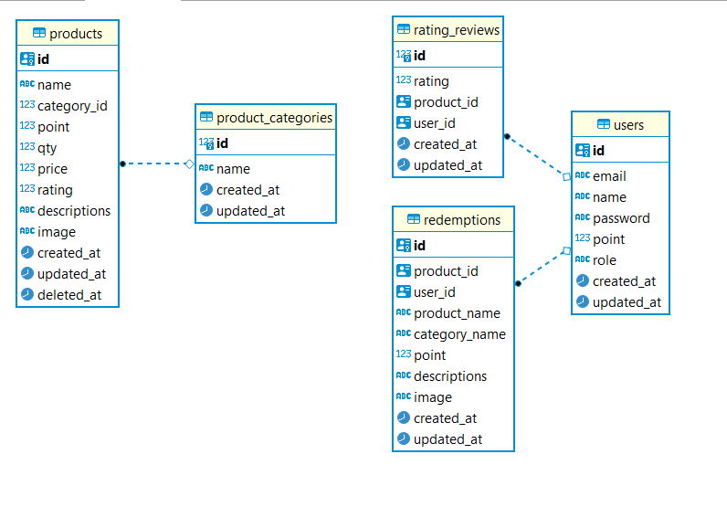

# siska-rgb-golang-test
Technical Test Backend Developer

## About
This repository contains the API gifts redeem project for the technical test using Golang. 
The project provides CRUD operations gifts, create redeem, create rating and functionalities to register and login users. 
The system use role-based access control (RBAC) and allows access to gifts, redeem, rating using JWT authentication except get gifts, get gifts by ID and product categories can access without authentication.

## Technologies
- Golang 1.19
- Framework Fiber v2
- Caching Redis
- Database PostgreSql 15
- Manage Cloud Image Assets: Cloudinary-go

## Golang
Golang is a lightweight programming language that produces smaller application binaries than other languages. This helps reduce resource consumption and speeds up compile times. Golang has a strong and easy to implement concurrency model. Features like goroutines and channels allow developers to manage multiple tasks efficiently.

## PostgreSql
PostgreSQL has a more liberal open source license, the PostgreSQL license, which permits free use, modification, and distribution. This makes it more attractive to organizations that want greater freedom in software use and modification. PostgreSQL is known as a powerful and sophisticated DBMS, with broad support for features such as transactions, row-level locking, and more complex processing.

## Redis
Frequently accessed data (such as product category lists) is cached using Redis to reduce load on the database.

## Cloudinary
Product images are uploaded and stored on Go SDK Cloudinary https://cloudinary.com/documentation/go_integration, enabling efficient image management.

## Clean Architecture and Modular Design - Application Architecture
This application was built by implementing the principles of Clean Architecture and a modular approach. This concept helps separate the functional components of an application in well-defined layers, enabling easy maintenance and scalability. I also have 4 layers:
1. Models, stores various data structures used in different parts of the application, including request and response models. This helps separate the business logic from the data representation that is sent via the HTTP request and that is returned in response. 
2. Repositories, for interacting with data sources such as databases 
3. Services, contains the core business logic and use cases of the application.
4. Handlers, Handle HTTP requests and connect these requests with appropriate services or become a connecting wall between the user and the system. Receive all input and validate input according to the standards used.

In each module in this system have repositories, services, handlers and routes to define HTTP routes for each request in the application.

## Entity-Relationship Diagram (ERD)
The ERD illustrates the relationships between the entities (tables) in the database for the API Gifts Management project.



## Table Database

### Users
The `users` table is used to store user information.

### Product Categories
The `product_categories` table stores product categories.

### Products
The `products` table contains information on gift products that can be redeemed by users.

### Redemptions
The `redemptions` table records redeem transactions by users.

### Rating Reviews
The `rating_reviews` table is used to store user reviews and ratings of redeemed products.

## Database Structure
The PostgreSQL database structure used to store job-related information can be found and import database in the `docs/dump-rgb_gifts-202309012124.tar` file. This file contains the necessary SQL queries and schema to create and populate the required tables.

## API Endpoints
### Register
* `POST /register`: Create a new register user.
### Login
* `POST /login`: Login user.
### Profile
* `GET /profile`: Profile user after login.
* `PATCH /profile`: Update Profile user.

### Product Categories
* `GET /products/categories`: Retrieve all product categories.

### Gifts
* `GET /gifts`: Retrieve all data gifts.
* `GET /gifts/{id}`: Retrieve a specific gift by ID.

### Gifts Admin Role
* `POST /gifts`: Create a new gift(Admin role required).
* `PUT /gifts/{id}`: Update an existing gift by ID(Admin role required).
* `PATCH /gifts/{id}`: Update stock an existing gift by ID(Admin role required).
* `DELETE /gifts/{id}`: Delete a gift by ID (Admin role required).

### Gifts User Role
* `POST /gifts/{id}/redeem`: Create a new redeem gift item(Admin role required).
* `POST /gifts/{id}/rating`: Create a new rating gift item after redeem item(Admin role required).

## Database Optimizations
In this application, database optimization is done in several ways:

- **Indexing**: Indexes are added to columns that are frequently used in search and sort operations, to improve query performance.
- **Caching with Redis**: Redis is used as a cache to store frequently accessed data, such as a list of product categories or the results of certain queries.
- **Limit Settings**: The use of LIMIT is applied to query operations to retrieve a limited amount of data, avoiding retrieving all data if it is not needed.

## Installation and Setup Local
1. Clone the repository
2. Navigate to the project directory:
3. Rename or copy .env.example to .env and adjust database env and redis to your locale
4. download depedencies :
```bash
go mod tidy
```
5. run main.go in directory cmd
```bash
go run .\cmd\main.go
```

## Postman Collection
A Postman collection `docs/api-gifts-rolling-glory.postman_collection.json` is provided in this project. You can import the collection into Postman to quickly test the API endpoints. The collection includes pre-configured requests for each endpoint, allowing you to easily interact with the API and view the responses.

## Authentication
The API use API token authentication. To authenticate requests, include the API token in the request headers:
`Authorization: Bearer {api_token}`. To log in as the user you can register your own account. To log in as the admin user, use the following credentials:
* `email`: admin@rgb.id
* `password`: admin
